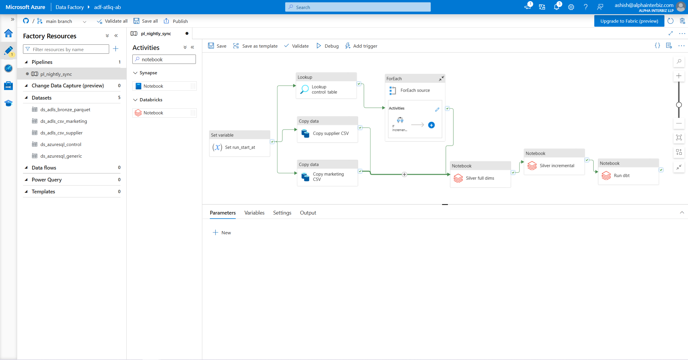
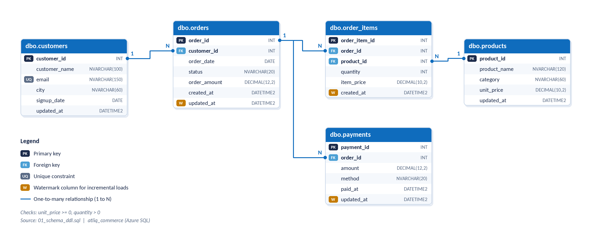
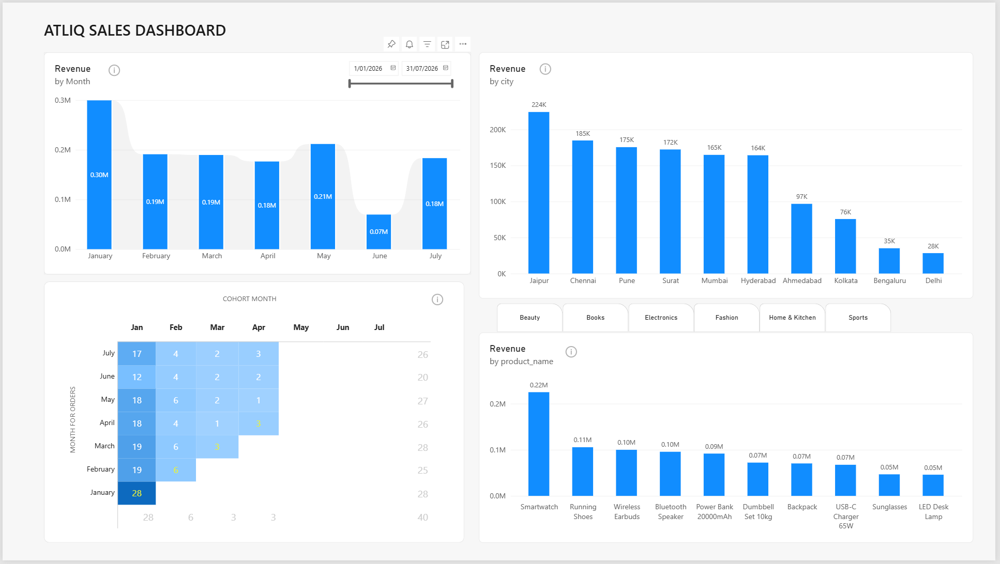

# Phase 1: Batch Lane

A nightly pipeline that moves AtliQ Commerce's storefront data from an OLTP database
into a governed lakehouse and a Power BI dashboard. One scheduled job, idempotent end to
end, tested on every change.

```
Azure SQL (OLTP, 3NF)
   -> ADF pl_nightly_sync         metadata-driven ingest, watermark incrementals
      -> Bronze   ADLS Gen2       Parquet, ingest_date partitions
      -> Silver   Databricks      Delta, PySpark MERGE on business keys
      -> Gold     dbt             star schema, 16 data-quality tests
   -> Power BI dashboard on Gold  Microsoft Fabric
```



## Stack

| Layer | Tool | Resource |
|---|---|---|
| Source | Azure SQL Database (serverless, Free Offer) | atliq_commerce |
| Ingestion | Azure Data Factory, Git-connected | adf-atliq-ab |
| Lake | ADLS Gen2, hierarchical namespace | atliqlakeab / lakehouse |
| Transform | Azure Databricks, Unity Catalog | dbw-atliq-ab, catalog atliq |
| Model | dbt Core on a Databricks SQL warehouse | atliq-dbt-wh |
| Serve | Power BI in Microsoft Fabric | atliq-sales-dashboard.pbix |
| Secrets | Azure Key Vault + Databricks secret scope | kv-atliq-ab, scope atliq |
| CI | GitHub Actions | .github/workflows/ci.yml |

## Milestones

Each milestone has a step-by-step deck (what was built, why, and the screenshot that
proves it). PDFs open directly in GitHub.

| # | Milestone | Proof point | Deck | Screenshots |
|---|---|---|---|---|
| M1 | OLTP database | 40 / 25 / 300 / 783 / 246 rows; revenue reconciles at 2,076,041.00 | [PDF](docs/decks/M1_OLTP_Database.pdf) | [M1](docs/screenshots/M1) |
| M2 | Ingestion to Bronze | One metadata-driven pipeline; second run copies 0 rows | [PDF](docs/decks/M2_Ingestion_to_Bronze.pdf) | [M2](docs/screenshots/M2) |
| M3 | Silver layer | MERGE upserts; re-run leaves counts unchanged | [PDF](docs/decks/M3_Silver_Layer.pdf) | [M3](docs/screenshots/M3) |
| M4 | Gold star schema | dbt build PASS=26 (10 models, 16 tests), ERROR=0 | [PDF](docs/decks/M4_Gold_Star_Schema.pdf) | [M4](docs/screenshots/M4) |
| M5 | Nightly automation | Two full runs: fact_sales 783 rows, 2,076,041.00 both times | [PDF](docs/decks/M5_Nightly_Automation.pdf) | [M5](docs/screenshots/M5) |
| M6 | Reporting in Fabric | Four visuals incl. first-order cohort retention matrix | [PDF](docs/decks/M6_Reporting_Fabric.pdf) | [M6](docs/screenshots/M6) |
| M7 | CI/CD and reliability | CI green on PR; failure alert; run audit log | [PDF](docs/decks/M7_CICD_Reliability.pdf) | [M7](docs/screenshots/M7) |

## Data model

Source (OLTP): five 3NF tables with watermark columns for incremental loads.



Gold: `fact_sales` at order-item grain (gross_revenue = quantity x item_price) with
`dim_customer` (signup_month cohort), `dim_product` (unit_margin from supplier cost),
and `dim_date` (2024 to 2026 spine, since signups start in 2024).



## Design decisions

- **Metadata-driven ingestion.** `etl.control_table` lists each source with its load type
  and watermark column. A new source is a new row, not a new pipeline.
- **Success-gated watermarks.** The watermark advances only after a copy succeeds, to the
  timestamp captured at run start, so failed runs retry safely and mid-run rows are
  caught next time.
- **Idempotent Silver.** Orders and payments MERGE update-when-newer; order_items is
  insert-only because line items never change.
- **Natural keys in Gold.** Type-1 dimensions from a single clean source, so surrogate keys
  would add nothing yet.
- **Explicit schema control.** A `generate_schema_name` macro stops dbt building into
  `gold_gold`.
- **One revenue definition.** Placed, Shipped and Delivered count as revenue; Returned is
  reported separately; Cancelled is excluded. Stated on the dashboard itself.
- **Direct warehouse connection for Fabric.** Gold is managed Unity Catalog tables, which
  made a OneLake shortcut impractical, and mirroring hit a storage-permission 403. Power BI
  imports from the Databricks SQL warehouse instead.
- **Cost control.** Serverless SQL on the Free Offer, job clusters that terminate per run,
  a SQL warehouse on auto-stop, and the nightly trigger paused after capture.

## Folders

```
phase1-batch/
├── oltp/            M1  schema DDL, seed scripts 02-06, control table, audit log,
│                        verify_counts.sql, verify_run_log.sql, daily_order_simulator.py
├── adf/             M2, M5  pipeline, datasets, linked services, trigger (committed by ADF)
├── databricks/      M3, M5  00_uc_setup, 10_silver_full_dims,
│                            20_silver_incremental_merge, run_dbt
├── dbt/atliq_gold/  M4  staging views, Gold models, tests, env-var profiles.yml
├── fabric/          M6  atliq-sales-dashboard.pbix
└── docs/                decks (PDF) and screenshots per milestone
```

## Run it

1. **OLTP.** Run `oltp/01` to `08` in order against `atliq_commerce`, then
   `verify_counts.sql`.
2. **Ingestion.** Connect ADF to this repo with root folder `/phase1-batch/adf`. Store the
   SQL password in Key Vault as `sql-admin-password`.
3. **Silver.** Run `databricks/00_uc_setup`, then `10_silver_full_dims` and
   `20_silver_incremental_merge`.
4. **Gold.** Set `DATABRICKS_HOST`, `DATABRICKS_HTTP_PATH` and `DATABRICKS_TOKEN`, then
   from `dbt/atliq_gold`: `dbt deps` and `dbt build --profiles-dir .`
5. **Nightly.** `pl_nightly_sync` chains all of the above; `run_dbt` reads its token from
   the `atliq` secret scope. Enable `trg_nightly` for the 01:00 daily run.
6. **Report.** Open `fabric/atliq-sales-dashboard.pbix` and point it at your SQL warehouse.
