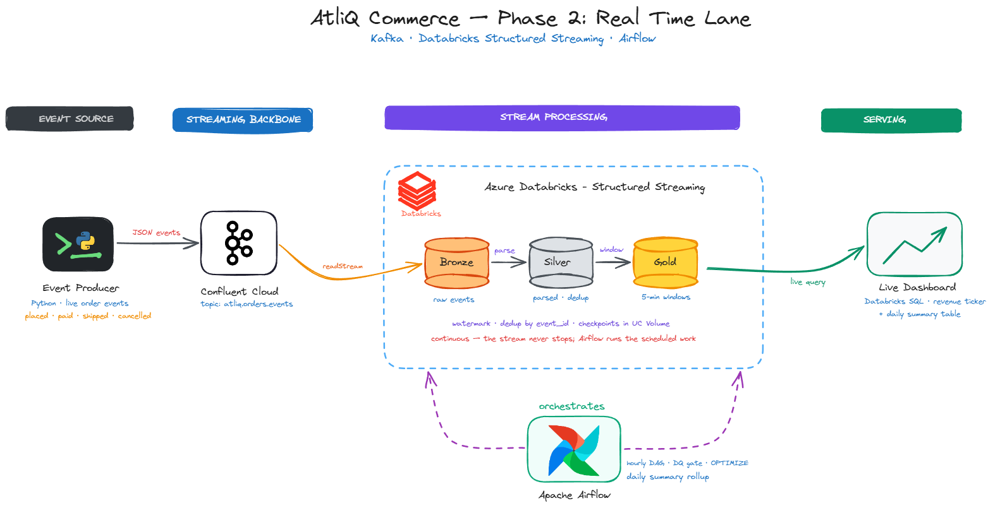
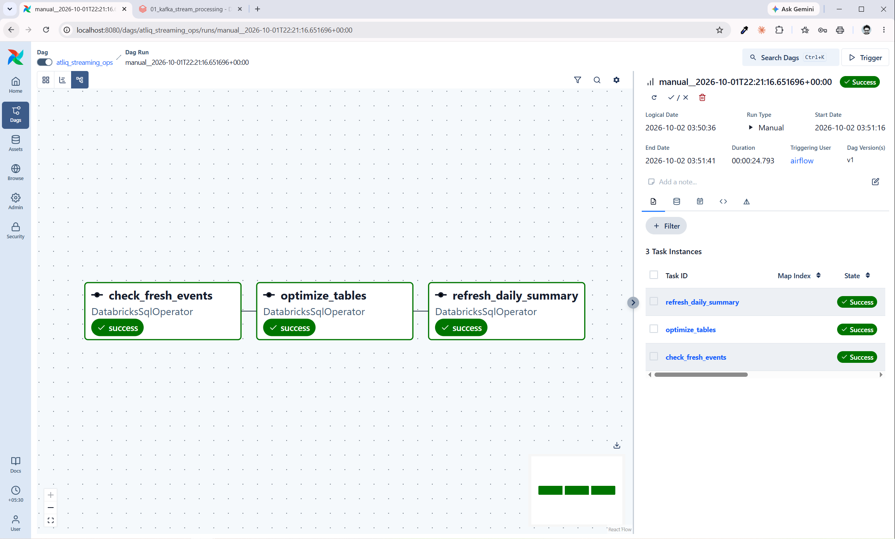
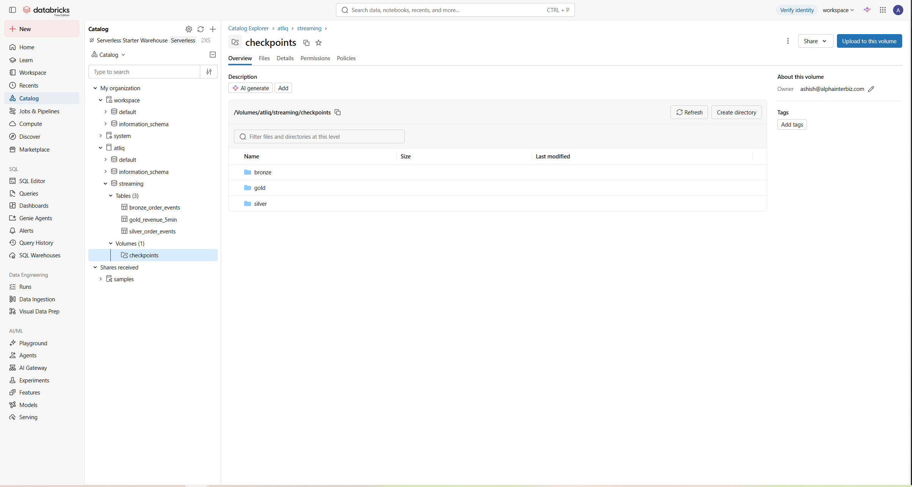
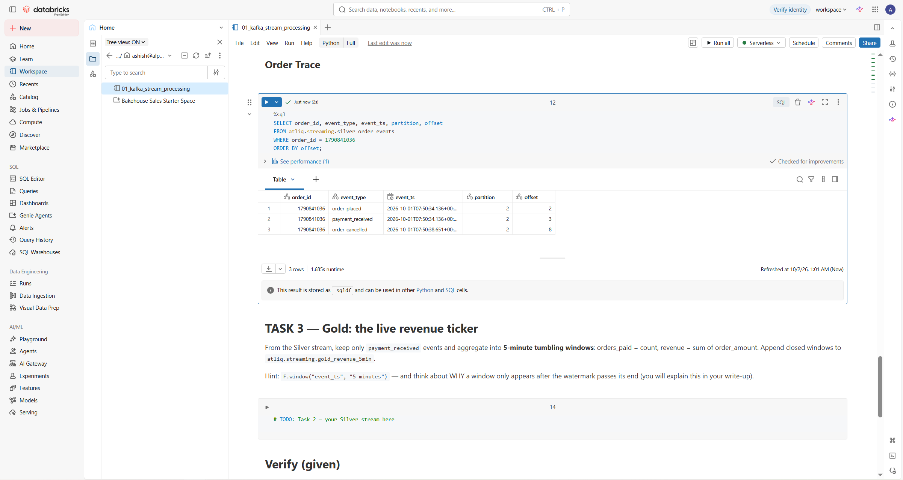
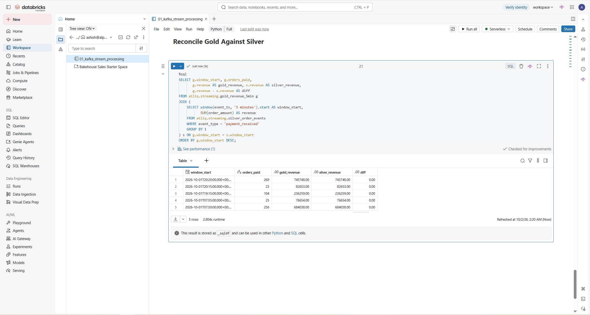
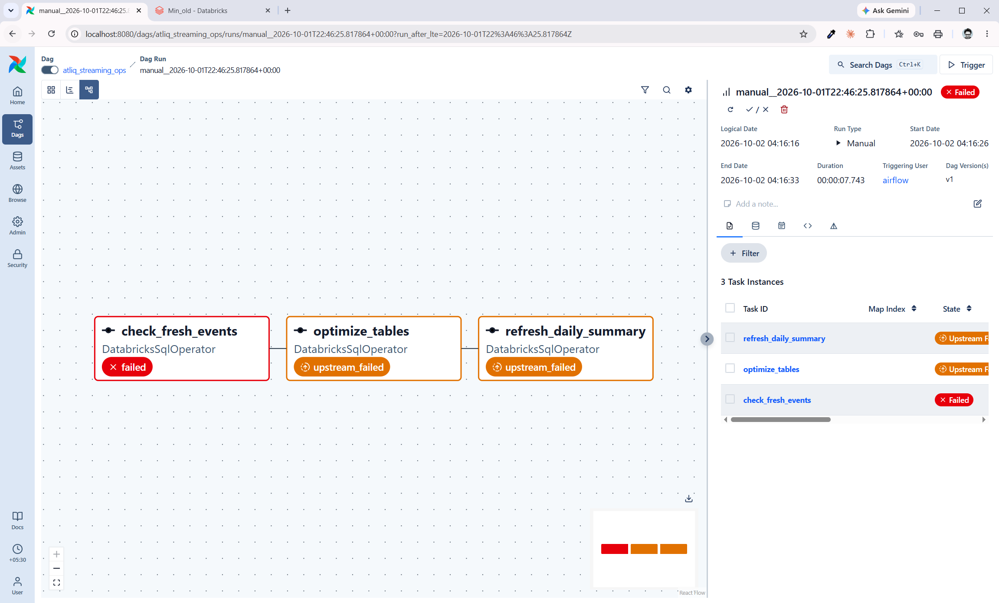

# Phase 2: Speed Lane

A real-time pipeline for AtliQ Commerce. Order events stream from a producer through
Kafka into a Databricks Medallion lakehouse within seconds, and an hourly Airflow DAG
guards their freshness, compacts their files and rolls up the day. Standalone: it shares
business keys with Phase 1, never tables.

```
Python producer          order events, keyed by order_id
   -> Confluent Kafka    topic atliq.orders.events, 6 partitions, 7-day retention
      -> Bronze          raw Kafka records               [Databricks Structured Streaming]
      -> Silver          parsed, typed, de-duplicated
      -> Gold            5-minute revenue windows
   -> Airflow, hourly    freshness gate, OPTIMIZE, daily rollup
```





## Stack

| Layer | Tool | Resource |
|---|---|---|
| Event source | Python 3, confluent-kafka | `producer/order_event_producer.py` |
| Streaming backbone | Confluent Cloud, Basic cluster, Azure Central India | `atliq-kafka`, topic `atliq.orders.events` |
| Processing | Databricks Free Edition, serverless, Unity Catalog | catalog `atliq`, schema `streaming` |
| Checkpoints | Unity Catalog volume | `/Volumes/atliq/streaming/checkpoints/{bronze,silver,gold}` |
| Orchestration | Apache Airflow 3.3.2 in Docker (WSL 2) | DAG `atliq_streaming_ops` |
| Warehouse | Databricks SQL, Serverless Starter Warehouse | used by the DAG |
| Secrets | git-ignored `.env`, Databricks secret scope, Airflow connection | `atliq-kafka`, `databricks_default` |

## Tasks

Each task has a step-by-step deck (what was built, why, and the screenshot that proves
it). PDFs open directly in GitHub.

| # | Task | Proof point | Deck | Screenshots |
|---|---|---|---|---|
| T1 | Kafka up, events flowing | 879 events sent, 0 undelivered; same key, same partition | [PDF](docs/decks/T1_Kafka_Events_Flowing.pdf) | [T1](docs/screenshots/T1) |
| T2 | Bronze and Silver | 879 landed, then 343 more read incrementally: 1,222 rows, 0 duplicates | [PDF](docs/decks/T2_Bronze_Silver.pdf) | [T2](docs/screenshots/T2) |
| T3 | Gold revenue ticker | 5 closed windows; Gold vs Silver diff 0.00 on every window; 3 checkpoints | [PDF](docs/decks/T3_Gold_Revenue_Ticker.pdf) | [T3](docs/screenshots/T3) |
| T4 | Airflow streaming ops | Green in 24.8 s at 99 min old; DQ FAIL in 7.7 s at 124 min; a real retry recovered | [PDF](docs/decks/T4_Airflow_Streaming_Ops.pdf) | [T4](docs/screenshots/T4) |

Write-up (batch vs speed lane, late Gold windows, keying): **[docs/writeup.md](docs/writeup.md)**.

## Data model

Four tables in `atliq.streaming`, each with its own checkpoint folder in the
`checkpoints` volume.

| Table | Grain | Written by |
|---|---|---|
| `bronze_order_events` | one row per Kafka record: raw JSON plus topic, partition, offset, timestamps | Bronze stream |
| `silver_order_events` | one row per unique event, typed columns | Silver stream |
| `gold_revenue_5min` | one row per closed 5-minute window: orders_paid, revenue | Gold stream |
| `gold_daily_summary` | one row per UTC date: placed, paid, cancelled, revenue | Airflow, hourly |



Silver keeps each order's lifecycle in sequence because events are keyed by `order_id`:
order 1790841036 was placed, paid and then cancelled, all on partition 2.



Gold publishes a 5-minute window only once it is final, and every window reconciles with
Silver to the paisa.



## Design decisions

- **Databricks Free Edition.** The guide's stack and the session demo use it, and it
  costs nothing. The architecture image says Azure Databricks; the code is identical on
  either, and keeping Phase 2 off the Phase 1 workspace keeps the lanes independent.
- **No secrets in code.** The starter notebook expects Kafka credentials in its config
  cell, but that notebook is committed. They live in the Databricks secret scope
  `atliq-kafka` instead, entered once from a scratch notebook that was then deleted.
  Locally they sit in a git-ignored `.env`; Airflow's Databricks token is encrypted with
  a Fernet key set before first start and scoped to SQL only.
- **Keyed by order_id.** Kafka orders events only within a partition; equal keys share a
  partition, so each order's lifecycle stays in sequence.
- **One checkpoint per stream.** Bronze, Silver and Gold each resume from their own
  bookmark: no loss and no duplicates on restart, and any one can be reset alone.
- **availableNow, run in sequence.** Serverless allows only this trigger. Each stream
  waits for the previous one with `awaitTermination()`, so Silver reads a finished Bronze.
- **Bounded de-duplication.** Silver drops duplicates on `(event_id, event_ts)` under a
  10-minute watermark: the same result as `event_id` alone, but Spark can discard old
  state instead of remembering every ID forever.
- **Final windows only.** Gold re-declares the watermark (it does not travel between
  tables) and writes in append mode, so a window is published once, when it is final.
- **Gate first, fail fast.** `check_fresh_events` runs before maintenance and the rollup,
  with `retries=0`; the other tasks keep two retries for transient failures.
- **Unique order IDs per run.** The starter restarted IDs at 100000 on every run; seeding
  them from the clock keeps orders from separate runs distinct.

## Found in testing

- **Gold trails real time by 10 to 20 minutes.** The newest windows wait in streaming
  state until the watermark passes them and a later run writes them. The daily summary,
  a batch rollup over all of Silver, is therefore ahead of the ticker within the day.
- **Serverless auto-compacts.** Silver's history shows OPTIMIZE seconds after each
  streaming write, so the DAG's OPTIMIZE on Silver was a no-op, while on Gold it still
  compacted 5 files into 1.
- **Overlapping runs collided.** Unpausing started the latest hourly slot alongside a
  manual run; both rebuilt `gold_daily_summary`, Delta rejected one write and the retry
  recovered it. Setting `max_active_runs=1` on the DAG would prevent the overlap.
- **Two revenue definitions.** The speed lane counts payments received (cash collected,
  including orders later cancelled); the batch lane excludes cancelled orders (net
  sales). Daily dates are UTC.

The freshness gate, proven on stale data: `check_fresh_events` fails and nothing
downstream runs.



## Folders

```
phase2-streaming/
├── producer/      T1  order_event_producer.py, requirements.txt, .env.example
├── databricks/    T2, T3  01_kafka_stream_processing (Bronze, Silver, Gold streams)
├── airflow/       T4  docker-compose.yaml, dags/atliq_streaming_ops_dag.py
└── docs/              architecture, write-up, decks (PDF), screenshots per task
```

## Run it

1. **Kafka.** Create a Confluent Cloud Basic cluster, the topic `atliq.orders.events`
   and an API key. Copy `producer/.env.example` to `producer/.env` and fill it in.
2. **Producer.** From `producer/`: `pip install -r requirements.txt`, then
   `python order_event_producer.py --rate 2 --duration 180`.
3. **Secrets.** Create the Databricks secret scope `atliq-kafka` with keys `bootstrap`,
   `api-key` and `api-secret`.
4. **Streams.** Import `databricks/01_kafka_stream_processing.py`, attach serverless
   compute and run the cells in order: config, Bronze, Silver, Gold.
5. **Airflow.** In `airflow/`, create `.env` with `AIRFLOW_UID=50000`,
   `_PIP_ADDITIONAL_REQUIREMENTS=apache-airflow-providers-databricks` and a `FERNET_KEY`,
   then `docker compose up airflow-init` and `docker compose up -d`. Add the connection
   `databricks_default` (workspace host, SQL-scoped token), set the warehouse HTTP path
   in the DAG, unpause `atliq_streaming_ops` and trigger it.
